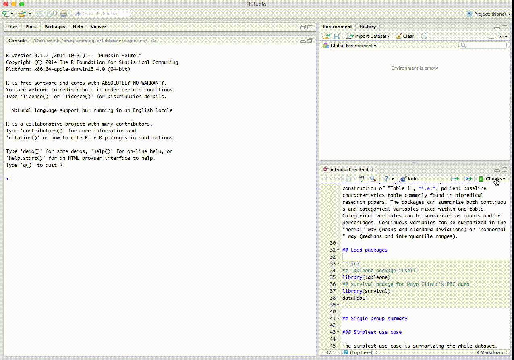

tableone (release repo)
===============================================================================

[](https://travis-ci.org/kaz-yos/tableone)

**An R package to create "Table 1", description of baseline characteristics**

Creates "Table 1", i.e., description of baseline patient characteristics, which is essential in every medical research. Supports both continuous and categorical variables, as well as p-values and standardized mean differences. Weighted data are supported via the survey package.

tableone was inspired by descriptive statistics functions in Deducer , a Java-based GUI package by Ian Fellows. This package does not require GUI or Java, and intended for command-line users.


tableone in action
-------------------------------------------------------------------------------



The code being executed can be found in the introduction vignette.

A higher quality version is available at YouTube: https://www.youtube.com/watch?v=IZgDKmOC0Wg&feature=youtu.be


tableone code example
-------------------------------------------------------------------------------

In this table, continuous and categorical variables can be placed in any order. The p-valeus are from exact tests for pre-specified variables. For nonnormal variables, it shows median and IQR instead of mean and SD, and p-values are from nonparametric tests. Numerically coded categorical variables can be transformed on the fly with factorVars. SMD stands for standardized mean differences. For weighted data, first created a svydesign object, and use the svyCreateTableOne() function. Most other options remain the same.

```

> ## Load data
> library(survival); data(pbc)
> # drop ID from variable list
> vars <- names(pbc)[-1]
> ## Create Table 1 stratified by trt (can add more stratifying variables)
> tableOne <- CreateTableOne(vars = vars, strata = c("trt"), data = pbc,
+                             factorVars = c("status","edema","stage"))
> ## Specifying nonnormal variables will show the variables appropriately,
> ## and show nonparametric test p-values. Specify variables in the exact
> ## argument to obtain the exact test p-values.
> print(tableOne, nonnormal = c("bili","chol","copper","alk.phos","trig"),
+       exact = c("status","stage"), smd = TRUE)


                        Stratified by trt
                        1                         2                         p      test    SMD
n                           158                       154
time (mean (sd))        2015.62 (1094.12)         1996.86 (1155.93)          0.883          0.017
status (%)                                                                   0.884 exact    0.054
   0                         83 (52.5)                 85 (55.2)
   1                         10 ( 6.3)                  9 ( 5.8)
   2                         65 (41.1)                 60 (39.0)
trt (mean (sd))            1.00 (0.00)               2.00 (0.00)            <0.001          Inf
age (mean (sd))           51.42 (11.01)             48.58 (9.96)             0.018          0.270
sex = f (%)                 137 (86.7)                139 (90.3)             0.421          0.111
ascites (mean (sd))        0.09 (0.29)               0.06 (0.25)             0.434          0.089
hepato (mean (sd))         0.46 (0.50)               0.56 (0.50)             0.069          0.206
spiders (mean (sd))        0.28 (0.45)               0.29 (0.46)             0.886          0.016
edema (%)                                                                    0.877          0.058
   0                        132 (83.5)                131 (85.1)
   0.5                       16 (10.1)                 13 ( 8.4)
   1                         10 ( 6.3)                 10 ( 6.5)
bili (median [IQR])        1.40 [0.80, 3.20]         1.30 [0.72, 3.60]       0.842 nonnorm  0.171
chol (median [IQR])      315.50 [247.75, 417.00]   303.50 [254.25, 377.00]   0.544 nonnorm  0.038
albumin (mean (sd))        3.52 (0.44)               3.52 (0.40)             0.874          0.018
copper (median [IQR])     73.00 [40.00, 121.00]     73.00 [43.00, 139.00]    0.717 nonnorm <0.001
alk.phos (median [IQR]) 1214.50 [840.75, 2028.00] 1283.00 [922.50, 1949.75]  0.812 nonnorm  0.037
ast (mean (sd))          120.21 (54.52)            124.97 (58.93)            0.460          0.084
trig (median [IQR])      106.00 [84.50, 146.00]    113.00 [84.50, 155.00]    0.370 nonnorm  0.017
platelet (mean (sd))     258.75 (100.32)           265.20 (90.73)            0.555          0.067
protime (mean (sd))       10.65 (0.85)              10.80 (1.14)             0.197          0.146
stage (%)                                                                    0.205 exact    0.246
   1                         12 ( 7.6)                  4 ( 2.6)
   2                         35 (22.2)                 32 (20.8)
   3                         56 (35.4)                 64 (41.6)
   4                         55 (34.8)                 54 (35.1)

```


Installation
-------------------------------------------------------------------------------

This is the release version of the tableone package either to be released on CRAN or is already on CRAN. The installation can be done by the usual package installation via CRAN.

- https://cran.r-project.org/package=tableone

If you prefer to follow the latest development, please see the developmetal repo:

- https://github.com/kaz-yos/tableone/tree/develop
